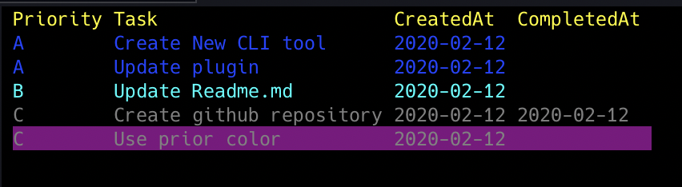
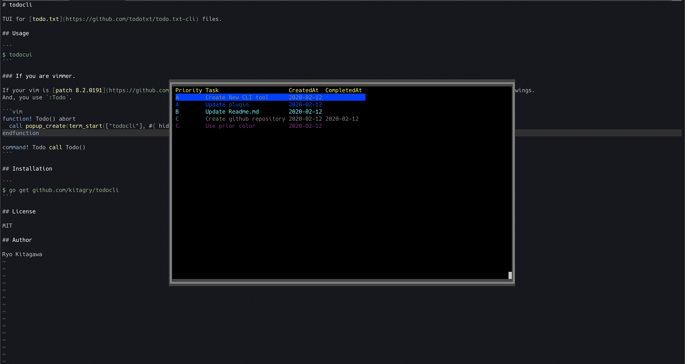

# todocli

TUI for [todo.txt](https://github.com/todotxt/todo.txt-cli) files.


## Usage

```
$ todocui
```

|command|explain|
|:-----:|:-----:|
|   n   | Create new todo |
|   d   | Delete selected todo |
|   q   | Save and Finish todocli |
|   a   | Set todo priority A |
|   b   | Set todo priority B |
|   c   | Set todo priority C |
| Enter | Change todo |
| Ctrl-C | **Unsave** and finish todocli |


### If you are vimmer.

If your vim is [patch 8.2.0191](https://github.com/vim/vim/commit/219c7d063823498be22aae46dd024d77b5fb2a58) or above, you can write in your VIMRC as followings.
And, you use `:Todo`.

```vim
function! Todo() abort
  call popup_create(term_start(["todocli"], #{ hidden: 1, term_finish: 'close'}), #{ border: [], minwidth: winwidth(0)/2, minheight: &lines/2 })
endfunction

command! Todo call Todo()
```



## Installation

```
$ go get github.com/kitagry/todocli
```

## License

MIT

## Author

Ryo Kitagawa
